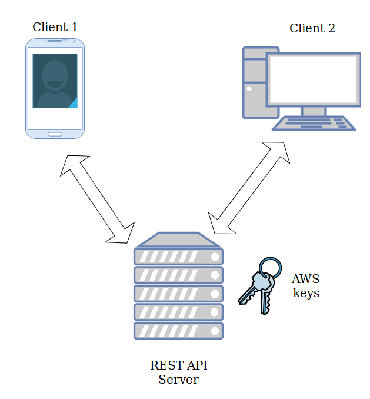
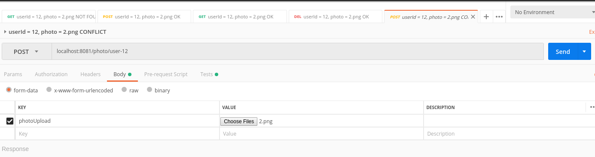
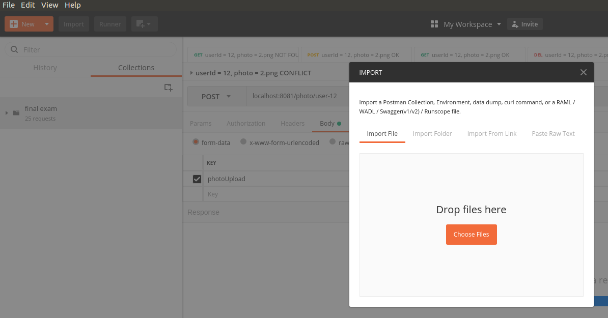

# Final Exam project

You need to implement a `photo-service` service  for user profile photos. The `photo-service` saves all photos to Amazon S3. 
When a photo is requested the URL of photo is provided by `photo-service`. User ID is unique. Photo can be of `jpg/png` format. A user can have *multiple* photos.

## Requirements
* Photos must be stored in S3 bucket
* Photos must not saved/stored locally
* `photo-service` must provide pre-signed URLs of photos (described below)
* `photo-service` must serve REST GET, POST, DELETE requests (no PUT)
* `photo-service` must pass all POSTMAN tests 

## Bucket structure
All objects (photos) have the following path structure: `userId/fileName`. For example, if `userId = user-123` and `fileName = avatar.png`,
then the object key of photo should be `user-123/avatar.png`. One user *may* have many photos, i.e. objects with keys `user-123/ava.png`, `user-123/profile.jpg`, `user-123/bestImage.jpg` may all exist in bucket.

### URL of photo
When keeping photos on AWS S3 it is convenient to generate photo URL than passing the file itself. If we pass the file, REST server needs to 
download the photo and only then send it to client.
However, in order to access the photo AWS S3 keys are needed. We cannot store the keys on all clients. If all keys are stored on clients, 
our data is not secure. Anyone would have access to our buckets, objects, files, etc.

### Pre-Signed (пре-подписанная) URL
In order to generate an URL that will be accessible on clients (without giving AWS keys to clients), AWS S3 
provides pre-signed URLs. A server where AWS S3 keys are stored, generates a pre-signed URL that has expiration time. 
While not expired, such URL is accessible by any client.

When getting a photo from AWS S3, `PhotoService` generates such pre-signed URL that has an expiration period of 1 hour.

### Service responses
The service should have the following responses:
* Accepted `status code = 200`, `message = OK`
* PhotoUrl `status code = 200`, `url = URL to photo (AWS)`
* Error photo not found `status code = 404`, `message = Photo not found`
* Error photo exists `status code = 409`, `message = Such file already exists`

### Testing using Postman
When testing using Postman tool, to upload a photo it should manually be selected as body of POST request.
**Important** When uploading a file, **key** must be set to `photoUpload`

Postman collection for testing is in project directory `./postman/final_exam.postman_collection.json`
You should import it to your Postman tool
